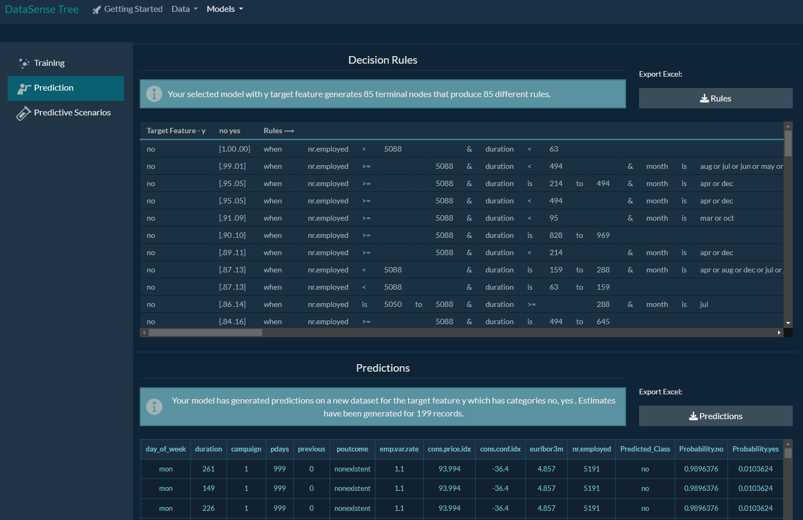

# DataSense-Tree: Interactive Decision Tree Web App (Beta Version)

**Version:** 0.1.0-beta

**DataSense-Tree** is an interactive web application (currently in beta) that enables easy training and testing of decision tree models, data analysis, testing different prediction scenarios, and making predictions on new datasets. The application uses **Recursive Partitioning and Regression Trees** for building decision tree models.

## Features 🌟

✅ **Interactive Decision Tree Training & Testing** – Train and test decision tree models using **Recursive Partitioning and Regression Trees**.  

✅ **Data Import** – Supports CSV and Excel file formats for easy data loading.  

✅ **Basic Statistics** – View essential dataset metrics like mean, min/max, and distributions.  

✅ **Model Visualization** – Interactive visualization of classification or regression trees.  

✅ **Predictions on New Data** – Load datasets and generate predictions using trained models.  

✅ **Testing Predictive Scenarios** – Modify input features to analyze different prediction outcomes.  

✅ **Export Results** – Save generated predictions for further analysis.  

✅ **User-Friendly Interface** – Intuitive design for quick and easy model training. 

### Getting Started

#### 1. **Import Data** 

   Import your data (csv, excel) and begin discovering patterns.
   
   

#### 2. **Basic Statistics** 

   Review the basic statistics of your dataset, including metrics like mean, min/max, and other parameters.
   
   

#### 3. **Training and Testing the Model** 

   Interactively train, test, select, and visualize the best-fit classification or regression decision tree model for your dataset.
   
   

#### 4. **Import Data for Prediction** 

   Import the data for which you want to make predictions.
   
   

#### 5. **Get Predictions**

   After loading new data, review the predictions generated by the model for that data. You can export the results.
   
   

#### 6. **Test Various Predictive Scenarios**

   Test different predictive scenarios by changing the values of influential features and see how those changes impact the target outcome.
   
   
   

The app is user-friendly, and all features are intuitively designed to help you get started quickly.

### Technologies Used 🛠️

This application is built using the following technologies and packages:

- **R** (>= 4.3.1)
- **readxl** (>= 1.4.3) 
- **shinythemes** (>= 1.2.0) 
- **plotly** (>= 4.10.2) 
- **htmlwidgets** (>= 1.6.2) 
- **IRdisplay** (>= 1.1) 
- **shinyjs** (>= 2.1.0) 
- **bslib** (>= 0.5.1) 
- **reactable** (>= 0.4.4) 
- **shiny** (>= 1.7.5) 
- **dplyr** (>= 1.1.2) 
- **flexdashboard** (>= 0.6.2) 
- **tidyr** (>= 1.3.0) 
- **sparkline** (>= 2.0) 
- **lubridate** (>= 1.9.2) 
- **tibble** (>= 3.2.1) 
- **shinyglide** (>= 0.1.4) 
- **dataPreparation** (>= 1.1.1) 
- **shinycssloaders** (>= 1.0.0) 
- **rpart** (>= 4.1.19) 
- **RColorBrewer** (>= 1.1.3) 
- **visNetwork** (>= 2.1.2) 
- **shinyWidgets** (>= 0.7.6) 
- **caret** (>= 6.0.94) 
- **kableExtra** (>= 1.3.4) 
- **rpart.plot** (>= 3.1.1) 
- **openxlsx** (>= 4.2.5.2) 
